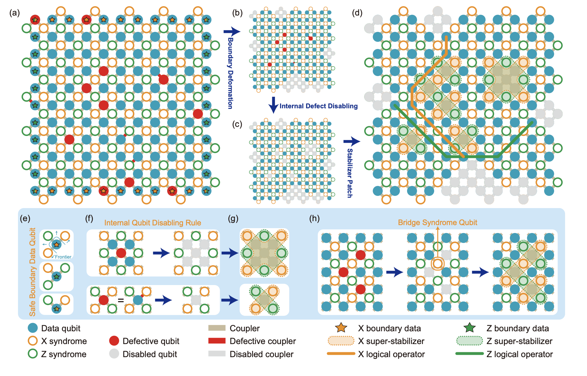
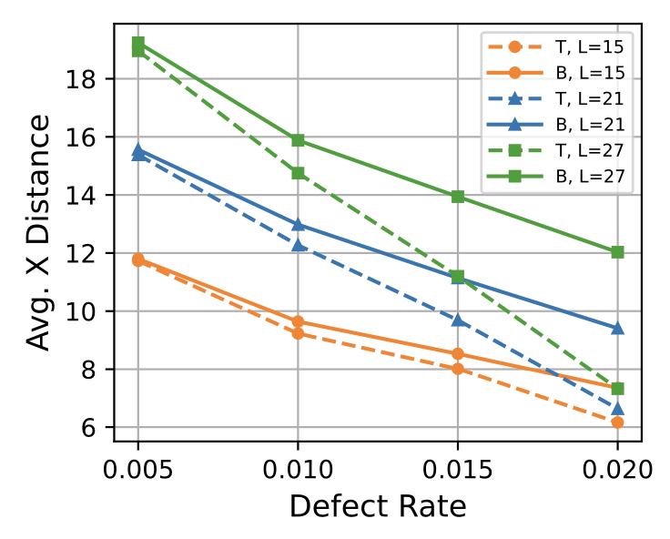
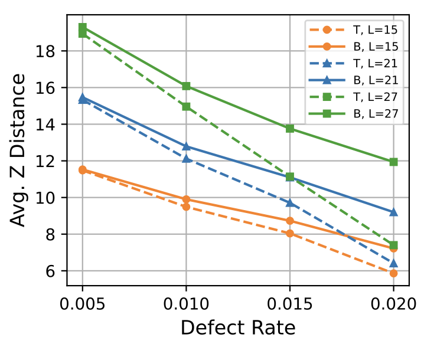
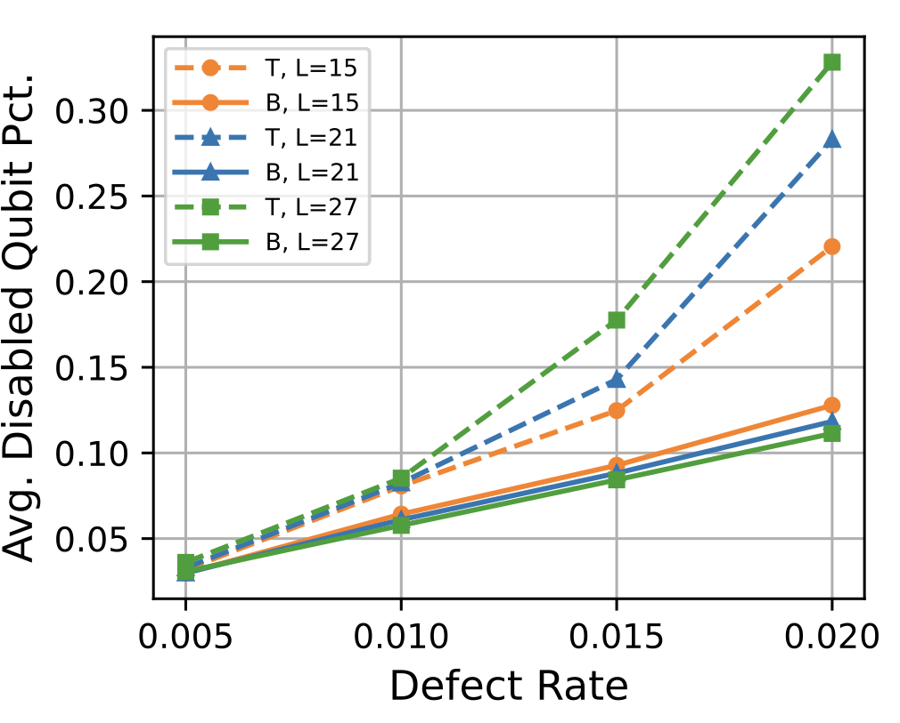

# Improvement in Stabilizer
Stabilizers are used to detect errors in the quantum state. In the context of surface code, stabilizers are operators that measure a group of qubits. When an error occurs, it changes the measurement outcomes of these stabilizers, indicating the presence and type of error. Nonetheless, as quantum computing scales, the defects in qubits and couplers due to fabrication errors become inevitable. These can significantly disrupt the surface codes error-correcting capabilities, which are essential for reliable quantum computation. **The paper (Low-Overhead Defect-Adaptive Surface Code with Bandage-Like Super-Stabilizers)**propose an automated adapter for surface codes that can handle defective lattices. This adapter includes three main subroutines: boundary deformation, internal defect disabling, and stabilizer patching. In this sector, we will briefly go through all the steps.

1. Boundary deformation: 
   
   We first begin the boundary deformation process by addressing defects along the boundary, focusing on removing unsafe boundary data qubits and redundant syndrome qubits. A boundary data qubit is considered safe if it meets three conditions: the qubit itself is defect-free, its surrounding frontier—including neighboring syndrome qubits and couplers—is also defect-free, and this frontier aligns with the boundary type, as example in **Fig. 1(e)**. We can simply use a Breadth-First Search (BFS) algorithm to evaluate the safety of each boundary data qubit. If one unsafe data qubit is found, the surrounding redundant syndrome qubits—those that are defective, have no undisabled data qubit neighbors, or are of different types from the boundary—are disabled. Following these guidelines, the surface code in **Fig. 1(a)**, will turn into **Fig. 1(b)**. The BFS algorithm continues to reevaluate boundary data qubits, checking any new unsafe ones and redundant syndrome qubits, until no new unsafe boundary data qubits are detected. This iterative process results in a defect-free boundary.
   
1. Internal Defect Disabling: 
   
   The process of internal defect disabling involves addressing defects within the lattice. Internal defects are classified into three types: data qubits, syndrome qubits, and couplers. According to the rules, for data qubit and coupler defects, we disable the corresponding data qubits, while for syndrome qubit defects, we disable the syndrome qubits and their neighboring data qubits, which shown in **Fig. 1(f)**. This is because internal data qubits need two X and two Z syndrome qubits to detect Z and X errors. The defects must be addressed in a specific order—first defective syndrome qubits, then defective data qubits, and finally defective couplers—in order to ensure each rule is applied only once and to prevent conflicts. Additionally, we disable weight-0 syndrome qubits (a weight-n syndrome qubit has n undisabled data qubit neighbors) resulting from these actions. Internal defects may cluster, particularly at high defect rates, leading to situations like weight-1 syndrome qubits and bridge syndrome qubits, where a syndrome qubit connects to two active data qubits along the same diagonal. As shown in **Fig. 1(h)**. Disabling these types of syndrome qubits, doing so might require reapplying internal defect rules, potentially disrupting the boundary shape and causing an avalanche effect where many qubits are disabled. To avoid this, the proposed method do not disable internal weight-1 and bridge syndrome qubits. Instead, the author use a bandage-like super-stabilizer strategy to reduce the number of disabled qubits, minimize super-stabilizer weight, and prevent an avalanche effect. 
   
1. Stabilizer Patching: 
   
   The proposed bandage-like super-stabilizers connect the same type of gauge syndrome qubits through disabled qubits, covering all internal disabled qubits. For unclustered internal defect qubits, these super-stabilizers are similarly to traditional super-stabilizers, which shown in **Fig. 1(g)**. While for clustered defect qubits, they stretch across weight-1 and bridge syndrome qubits, preserving more data qubits and maintaining integrity, as  shown in **Fig. 1(g)**. And then logical operators (X and Z) are placed on paths containing opposing types of syndrome qubits to avoid intersecting super-stabilizers and introducing gauge qubits. Eventually, the proposed method adapts the defect lattice depicted in **Fig. 1(a)** into surface code shown in **Fig. 1(d)**

    
    **Fig. 1 The Construction Steps for the Defect-Adaptive Surface Code.****(a) An instance of a defective surface code lattice,the defective qubits and couplers in red, and boundary qubits are marked with star symbols. (b) code lattice after boundary deformation (c) code lattice after internal defect disabling. (d) code lattice after stabilizer patch, respectively. (e) The depiction for boundary data qubits and their frontiers, including X, Z, and corner boundary data qubits from top to bottom, along with their frontiers, encompassing couplers and syndrome qubits around data qubits. (f) Depicts the rules for internal defect disabling, showcasing the disabled qubits rules for defect syndrome qubits, data qubits, and couplers from top to bottom. (g) practice traditional super-stabilizers if internal defect qubits are not clustered. (h) in clustered situations, these super-stabilizers can stretch across weight-1 and bridge syndrome qubits. The middle of (h) highlights a bridge syndrome qubit for illustration purposes.**

### STABILIZER MEASUREMENT CIRCUIT
Due to their anti-commuting gauge operators, constructing the stabilizer measurement circuits for adapted devices can't be directly measured like regular single-syndrome stabilizer. In the method, multiple bandage-like super-stabilizers may combine to form a group of super-stabilizers such as that in **Fig. 2**, where a group with two X and two Z bandage-like super-stabilizers. It is essential to ensure that X and Z super-stabilizers in the same group are not measured in the same cycle, while the same type within a group is measured simultaneously.

To enhance error correction capability, the method repeat the measurement of the same type of gauge operator for several consecutive cycles to gather information about each operator's value. The number of consecutive measurement cycles is referred to as the shell size, as shown in **Fig. 2**. It is necessary to determine the appropriate shell size for each stabilizer group while considering experimental constraints. There are two strategies for determining the shell size: the global strategy applies the same shell size to all stabilizer groups, while the local strategy assigns each group its own shell size. The choice of shell size depends on the processor and physical system characteristics
    
    **Fig 2**

### conclusion    
By following these steps, the method ensures a defect-adaptive surface code with enhanced efficiency, and also avoid overhead. The paper compared the traditional stabilizer with their proposed method. Naturally, code distance will decrease as defect rates gets higher. In contrast to the traditional stabilizer, the bandage stabilizer maintains a superior code distance, and this advantage grows as defect rates increase, similar to the above specific case. The result is demonstrated in **Fig. 3(c)(d)**. Besides, the proposed method also preserves code distance by disabling fewer qubits. The illustration is in **Fig. 3(e)** which shows the average percentage of disabled qubits after adaptation. Despite that disabled qubits increase with defect rates, the proposed method demonstrates a slower increase, which indicate better qubit preservation compared to the traditional method.
    
    **Fig. 3(c) Average X Distance vs Defect Rate**
    
    **Fig. 3(d) Average Z Distance vs Defect Rate**
    
    **Fig. 3(e) Average Disabled Qubit Percentage vs Defect Rate**
    